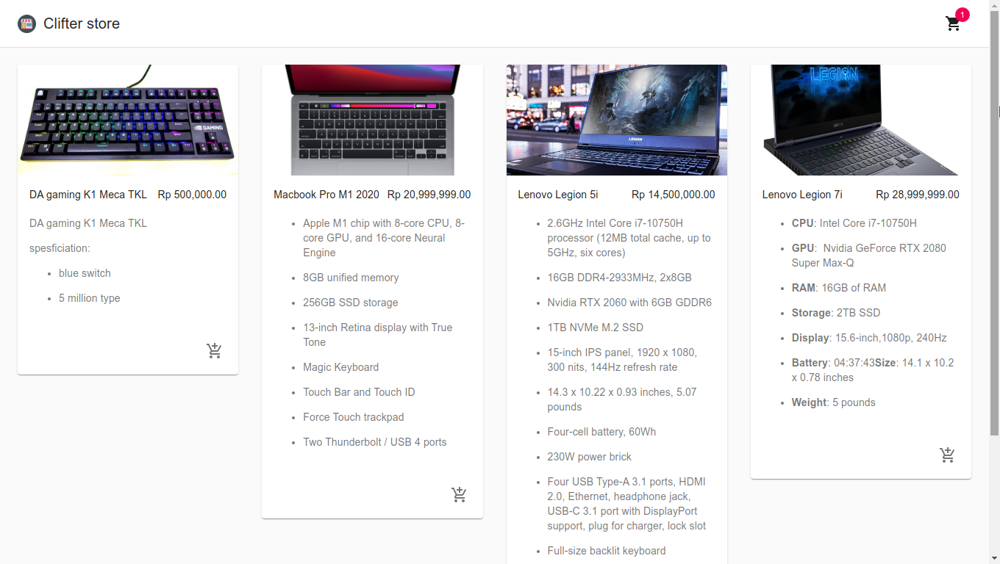
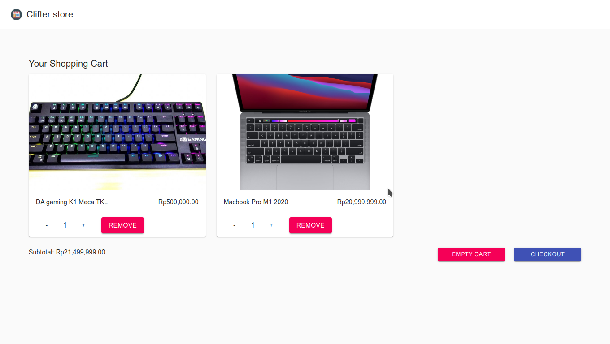
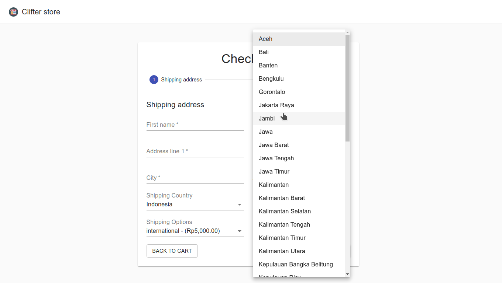

# commerceWebShop


## create products

create product [here](https://dashboard.chec.io/)
copy and paste public key api at `src/lib/commerce.js`

```js
export const commerce = new Commerce("PUBLIC API");
```

## running commerce web shop

```bash
cd commerce-web-shop
npm start
```

## images




